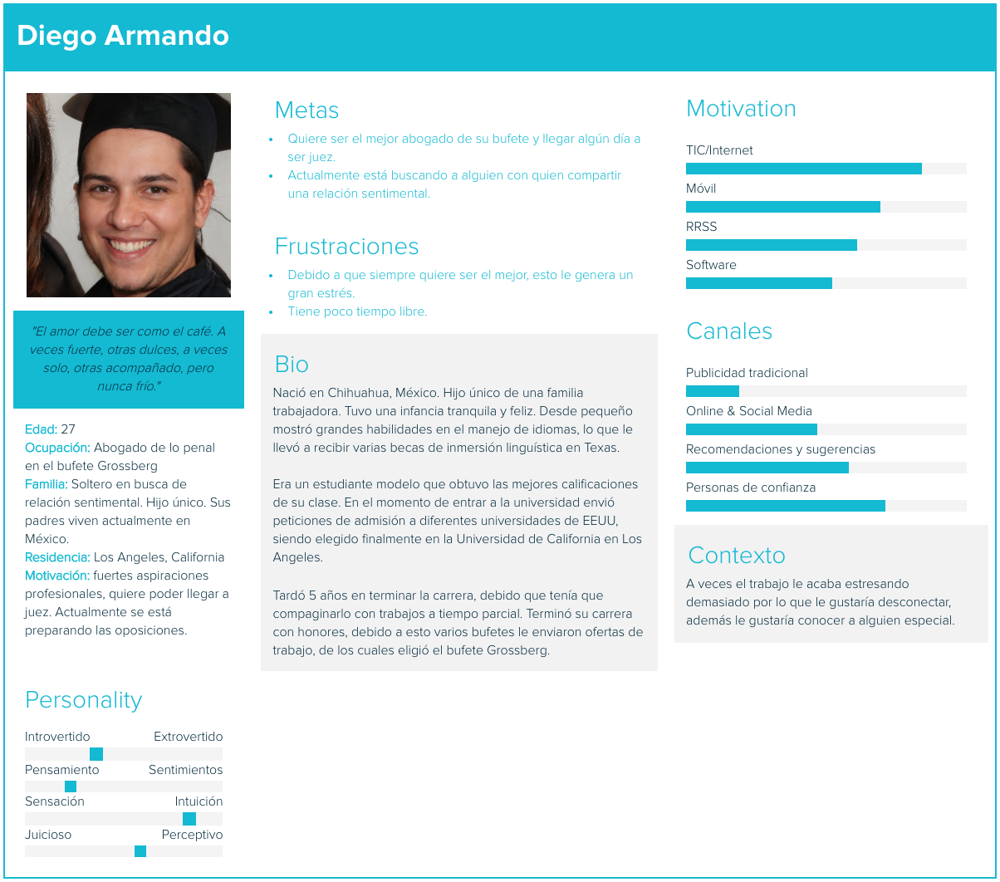
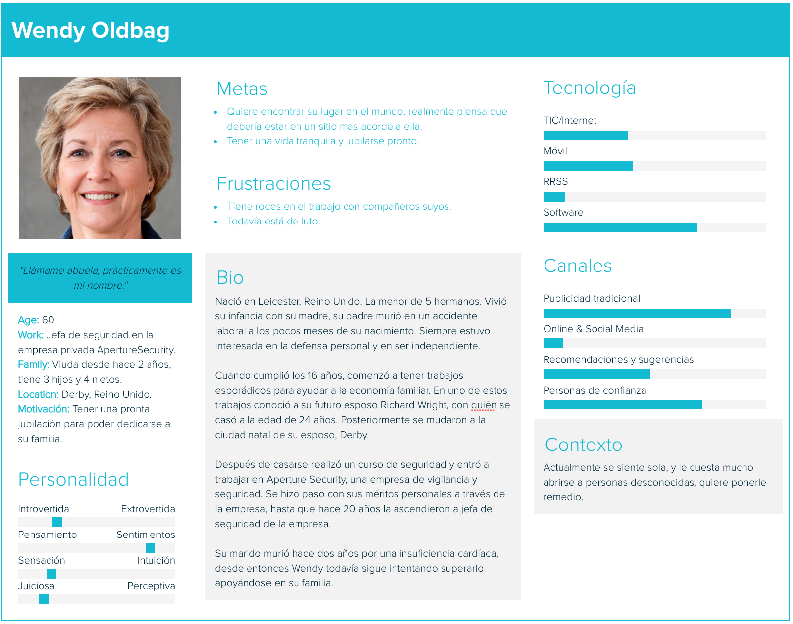
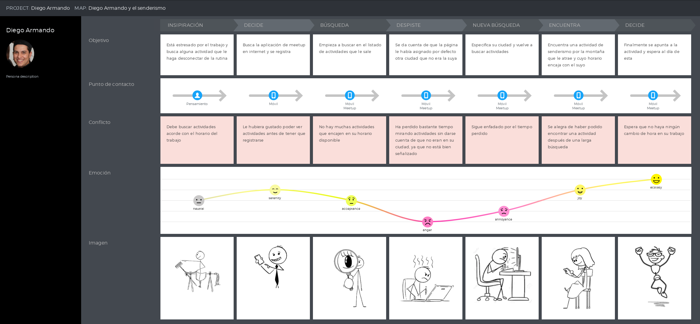
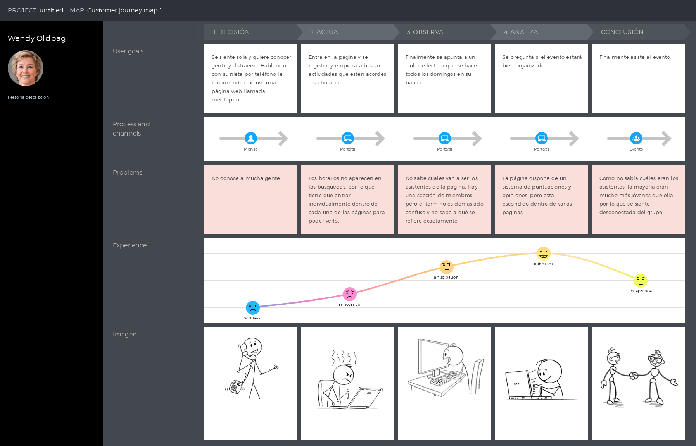

## DIU - Practica 1, entregables

### Análisis Competencia

#### Meetup
Nada más entrar en la página de meetup por primera vez, nos pide que nos registremos, si no, solo podremos ver los diferentes grupos de actividades que hay, pero no buscar por zona ni nombre ni fecha. Una vez iniciemos sesión, esto será mucho más fácil e intuitivo. Nos saldrá un listado ordenado por fecha y hora. Nosotros podremos elegir en que ciudad queremos buscar y el radio de la zona, pero por defecto sale asignado la capital de tu país, lo que puede llevar a errores. La búsqueda por palabra podría ser mejor, ya que solo encuentra actividades que contengan esa palabra exactamente, por ejemplo, si quieres dar un paseo y buscas “pasear” no te saldrán las opciones de senderismo o paseo, solo las que tengan “pasear” en el nombre o en la descripción. Al entrar en una actividad veremos la descripción de esta, los asistentes debajo de esta descripción, precio, lugar, fecha, hora y un botón en grande y en rojo para apuntarse, todo muy intuitivo y limpio.
Para crear un grupo para actividades (es necesario crear un grupo primero), en la página del listado aparecerá un apartado arriba diferenciado para hacerlo, el cual nos dará instrucciones claras y sencillas, imposible perderse. 
La cantidad y calidad del contenido depende de los usuarios, pero es una web muy utilizada, no faltan actividades.

#### Artery

Artery es una página que prácticamente no opera en España, es muy difícil de encontrar por búsqueda en google, y está entera en inglés. Al principio te pedirá registrarte para poder disfrutar de sus funcionalidades. Cuando buscas en una ciudad, las actividades salen ordenadas en cuadros en filas de tres, pero no del mismo tamaño, por lo que es lioso, y no queda claro si el orden es de arriba abajo o de izquierda a derecha. Además, la fecha no viene bien señalizada y los días y los meses vienen abreviados, lo que puede generar confusión. Puedes filtrar por diferentes categorías y distancia. La zona de mi perfil viene representada simplemente por una foto predefinida, por lo que encontrarla puede ser algo difícil. 
La búsqueda por palabra es liosa, ya que si buscas una palabra primero te salen personas, y después actividades que contengan esa palabra pero en todo el mundo, teniendo que poner posteriormente la zona, haciendolo todo más tedioso de lo que debería.
Para organizar actividades hay demasiadas opciones, empezando por las opciones de ‘host’ y ‘perform’, que no queda muy claro en que se diferencian y porqué debería elegir una u otra. Después, habrá que elegir entre varias opciones para diferentes aspectos de tu actividad, pero que pueden no ajustarse a lo que tú tenías en mente, y no deja flexibilidad, ya que no existe la opción de ‘otro’ o algo parecido. 

#### Eatwith

Esta página está hecha exclusivamente para experiencias culinarias, por lo que no va dirigida a la gran parte del público, sino solo a un pequeño nicho de personas. La página es muy fácil de usar, simplemente introduces en el buscador tu localización, el precio que pueda tener, y el tipo de evento (clases de cocina, comida conjunta, etc). Realizar una reserva es muy simple, únicamente hay que pulsar un botón y ya estamos inscritos. Respecto al resto de páginas de temática parecida no tiene nada que envidiar.

#### Sofarsounds

Esta página está orientada únicamente a conciertos y eventos musicales. Es obligatorio registrarse para poder acceder a todos los eventos. Una vez registrado solo es necesario poner una localización para poder acceder a todos los eventos que haya en esa ciudad. Cuando eliges un evento, automáticamente te redirige a una página con un video del artista que vaya a realizar el  concierto cantando una canción. Esta página es muy accesible y simple, no es complicada de usar, sin embargo solo está orientado a este tipo de eventos y su variedad por cada localización es muy pobre.

## Personas 

## Journey Map

## Revisión de Usabilidad

Puedes acceder al documento desde 
