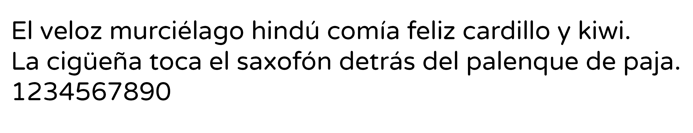

# Análisis del MuseMap

Con MuseMap, sus creadores nos han mostrado como hacer un gran estudio sobre UX y como afrontar el desarrollo de una idea desde el punto de vista del diseño.

### Puntos a favor
Los desarrolladores han seguido una estructura de estudio de una forma eficiente que les ha ayudado a seguir el desarrollo de su aplicación de una forma ordenada y siempre avanzando solucionando errores que tuvieran.
Desde el primer momento en el que tuvieron la idea de lo que querían hacer, dejaron muy claros los objetivos que necesitaban conseguir, y tuvieron claro que tipo de usuario sería su público objetivo y que querrían estos usuarios, algo que facilita mucho el estudio. Incluso hicieron un estudio a pie de campo, observando como se comporta la gente en lugares con arte callejero, lo cual asentó una buena base para empezar con el desarrollo.

Tras esto, hicieron un estudio exhaustivo de la competencia, valorando todas las opciones que ofertaban su competencia y que cosas les faltaba. El analizar a la competencia es un punto muy importante para saber a que te enfrentas, que puedes hacer para que tu idea sea mejor de lo que ya existe, y saber que puntos tienen en común para coger ideas a implementar en tu idea.

Tras esto vino un punto muy importante también el cual ayudó muchisimo, que es el poder preguntar a personas reales sobre sus opiniones, para ver como estaba realmente el mercado y la gente.

Con esta información resulta más fácil crear las personas ficticias y sus journy maps, lo cual si lo haces sin saber opiniones reales de los usuarios puede que estos puntos los desarrolles por un camino equivocado.

Otro estudio importante y acertado por parte de los desarrolladores de MuseMap es estudiar el recorrido que los usuarios harían dentro de la app, lo cual hace más ameno el desarrollo de interfaces de la aplicación.

Tras el prototipado de como estaría estructurada la app hicieron otro punto que consideramos muy acertado, preguntarle a usuarios reales que opinaban sobre los bocetos. Con esto puedes recibir un feedback realmente útil para acabar el desarrollo.

### Puntos a mejorar
Aunque es verdad que el trabajo realizado por el equipo de MuseMap es muy completo, nosotros echamos en falta algún procedimiento que sí que hubieramos incluido.

Por ejemplo, un estudio de los tipos de usuarios que van a utilizar la app y que funcionalidades requerirán y cuales usarán más y cuales menos. En este caso, por ejemplo, podrían tener en cuenta que habrá usuarios que sean artistas callejeros que solo les interese dar a conocer su arte y que prácticamente nunca usarán funcionalidades relacionadas con buscar otro tipo de arte o similares. Creemos que esta opción es importante para no pasar por alto a ningún tipo de usuario ni de función requerida solo por un pequeño porcentaje del público.

### Conclusión
Los desarrolladores han realizado verdaderamente un gran trabajo de diseño y planteamiento para su aplicación, usande una gran variedad de métodos que han abarcado prácticamente todas las necesidades que han tenido, facilitándole mucho el trabajo, demostrando la importancia de hacer un buen trabajo de análisis y la utilización de los métodos de estudio idóneos. Aún así, siempre hay un pequeño margen de mejora, como hemos comentado.

# Patrones de diseño y Guidelines

## Tipografia
La tipografía elegida para el proyecto que estamos desarrollando es una de palo seco debido a que se va a utilizar siempre en medios digitales y esto facilita su lectura y evita cansar la vista del usuario. Tambi ́en hemos pensado que esta tipografía tiene que ser ante todo funcional, es por eso que la hemos sacado de Google Fonts, porque ¿de qué nos hubiera servido elegir la tipografía más bella, si luego el dispositivo que se conecte a la página no la tiene y en su lugar usa una por defecto? Usando de este tipo evitamos justamente ese problema, siendo que es el servidor el que proporciona la tipografía y no el cliente.

Sabemos que las tipografías son como la voz de las aplicaciones, y siendo que nuestra aplicación se centra en actividades queremos que transmita energía al leerla. Es una tipografía con un estilo desenfadado, simple y muy divertido. Estamos hablando de Varela Round. Por supuesto esta es una fuente Open Font, por lo que podremos usarla sin problemas en nuestra página web.

# Valoración personal sobre la práctica
Tras la realización de esta práctica, y el anális del desarrollo de MuseMap, nos hemos dado cuenta de la importancia que tiene realizar unos métodos UX adecuados para poder seguir el desarrollo de la aplicación imaginada de la forma más dinámica y acertada posible. También nos hemos dado cuenta de la dificultad que tiene condensar el trabajo que tiene detrás cualquier desarrollo en una franja de tiempo menor a dos minutos, para que sea atractivo sin dejar puntos importantes en el camino. Aún así, estamos satisfechos con el trabajo realizado y con el aprendizaje obtenido, hoy somos mejores que ayer.

# Links
[Repositorio de Github](https://github.com/ralesdi/DIU20)

[Enlace al video presentación](https://drive.google.com/file/d/15g9UXXsQKBZ78SySnKnvGlWCMaZMkGeP/view?usp=sharing)
