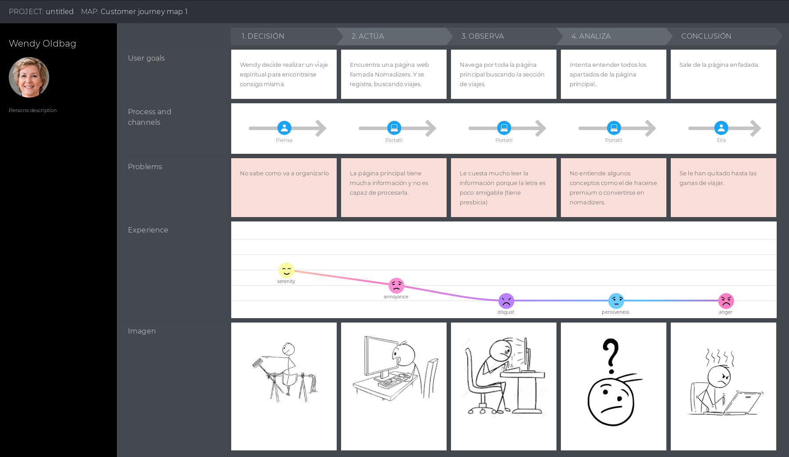
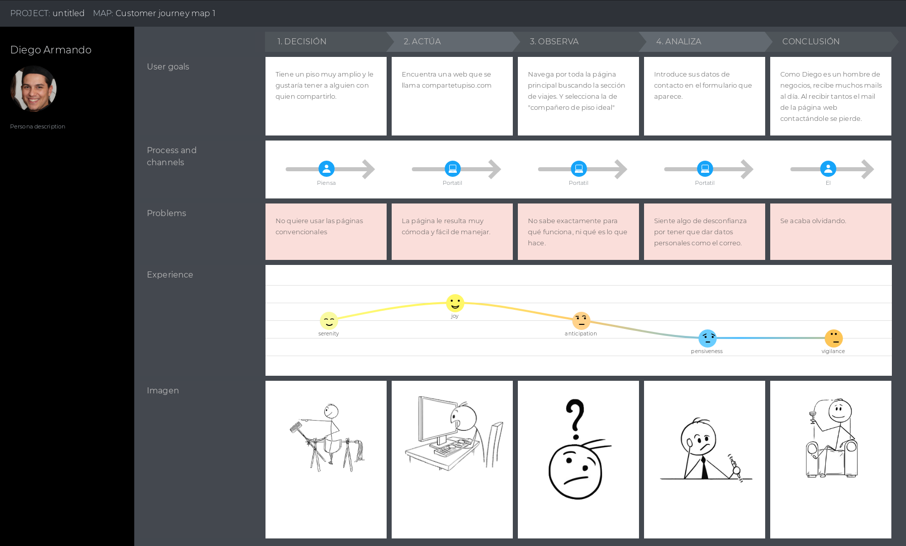

# Evaluación
En esta práctica, a lo largo de las semanas que hemos tenido para desarrollar nuestro trabajo hemos evaluado el desempeño de otros compañeros en las entregas de la asignatura.

## Equipo DIU1.MGM
El equipo [MGM](https://github.com/ralesdi/DIU20/blob/master/P4/UXCaseStudy-review%20DIU1-MGM.xls) ha dejado mucho que desear, básicamente porque no se ha notado un trabajo en la práctica, no entendiendo debidamente qué era lo que había que hacer, ya que en lugar de hacer una propuesta de aplicación ha hecho una propuesta de mejora de una página web. Sin embargo aún así hay puntos buenos que queremos destacar el trabajo que ha hecho en la creación de una de las personas, al igual que en el feedback capture grid.

El Journey Map que hemos hecho tiene relación con la página en la que se basa el equipo:
Hemos querido reflejar uno de los problemas que ha comentado el equipo en la práctica, que es la excesiva información y el uso de terminos ambiguos que puedan llevar a confusión a usuarios nuevos.

>Nota Final: **44**

## Equipo DIU2.Mjölnir
El equipo [MJölnir](https://github.com/ralesdi/DIU20/blob/master/P4/UXCaseStudy-review%20DIU2-Mjolnir.xls) ha sido un buen trabajo. Queremos destacar sobre todo el magnifico video realizado. Nos encantaron las personas, debido a que estaban muy bien detalladas y tenían incluso biografía que acompañaba a su ficha. Este equipo tiene muchos puntos fuertes, aunque en nuestra opinión flojea un poco en la propuesta, donde en lugar de proponer una aplicación propia propone la app de una página web en móvil.

El Journey Map que hemos hecho tiene relación con la app que ha desarrollado el equipo:
Aquí hemos querido reflejar un punto flojo de la aplicación, que es la dependencia que tiene esta de aplicaciones externas como pueden ser Facebook o el correo electrónico.

>Nota Final: **74**

## Equipo DIU3.Learning
El equipo [Learning](https://github.com/ralesdi/DIU20/blob/master/P4/UXCaseStudy-review%20DIU3-Learning.xls) nos ha sorprendido para bien. Ha demostrado haber desarrollado un trabajo impecable donde ha primado el esfuerzo por encima de todo. Tampoco ha faltado originalidad e imaginación en cada una de las prácticas. Prácticamente no tiene ningún punto negativo, como mucho el hecho de que los colores han sido elegidos en base a una imagen de internet.

El Journey Map que hemos hecho tiene relación con la app que propone el equipo:
En este caso hemos querido abordar la falta de accesibilidad de la que suelen pecar la gran mayoría de aplicaciones. Hemos puesto el caso de alguien con problemas visuales, debido a que, con los bocetos vistos, pensamos que la aplicación carecerá de accesibilidad al mostrar tanta información en pantalla y con tantos iconos y tan pequeños.

>Nota Final: **89**

## Conclusión

| 2º | 1º | 3º |
| ------------- | ------------- | ------------- |
| Mjölnir  | Learning  | MGM |

Esta práctica ha sido como una linea ascendente, pasando de menos a más. Hemos aprendido a valorar mucho el trabajo que hay detrás de todo el diseño de una aplicación, por simple que sea. Aunque se supone que todos deberíamos haber seguido una misma línea de trabajo nos hemos encontrado con tres situaciones completamente distintas. También nos ha sorprendido la manera que han tenido los distintos grupos de abordar un mismo problema desde sus propias perspectivas.

La interfaz de usuario y la experiencia que tiene el mismo suele pasar desapercivida en multitud de ocasiones, sobre todo por parte de los propios programadores y diseñadores de la aplicación, pero es algo que tenemos que tener siempre muy presente para poder desarrollar un producto que, no solo sea exitoso, sino amigable con el usuario e inclusivo con todo el mundo.
