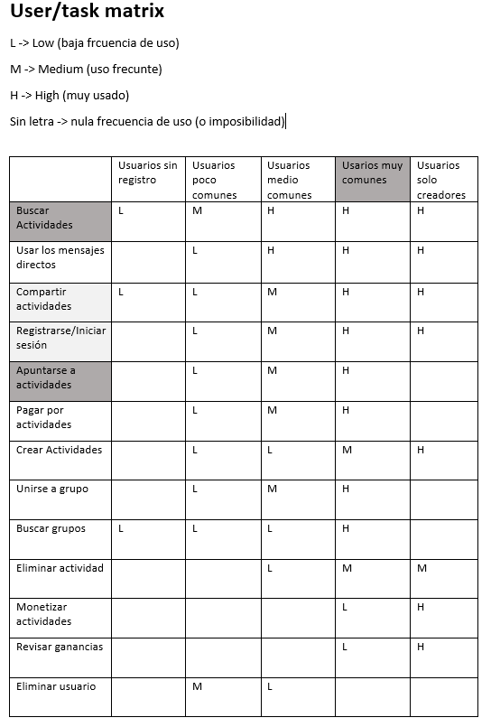
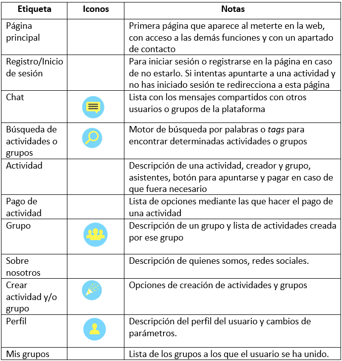

# DIU20
Prácticas Diseño Interfaces de Usuario 2019-20 (Economía Colaborativa)

Grupo: DIU3.JoinsTheBattle  Curso: 2019/20

Proyecto: Do it! (Experiencias de Compartir Ocio)

Descripción: Esta será una aplicación que permitirá a las personas tanto poder desarrollar actividades en la zona donde residen con posibilidad de poder monetizarlas, así como poder apuntarse a eventos y participar de actividades. También será una aplicación basada en la interacción entre usuarios dentro de la misma aplicación para crear estrechos vinculos y que toda la organización se pueda hacer sin tener que recurrir a aplicaciones o webs externas.

Logotipo: 

Miembros
 * :bust_in_silhouette: Alessandro Rinaldi Gómez  :octocat: \@Ralesdi  
 * :bust_in_silhouette: Germán Castilla López     :octocat: \@Gertis99

-----

# Do it!
## Una App de Actividades

Los seres humanos somos, por definición, seres sociales. No concebimos la vida sin la interacción con otras personas. Nos reunimos para hacer todo tipo de actividades. Pero en ocasiones nos encontramos trabas para satisfacer estas necesidades
sociales. A veces incluso, para personas introvertidas o que tengan un círculo de conocidos muy limitado puedes suponer un muro infranqueable. Nosotros decimos: ¡ya no más!

## Introducción

Buscamos crear una aplicación web que permita a cualquier persona completar dos objetivos fundamentales:
- Poder acceder a actividades de cualquier tipo cerca del usuario.
- Poder organizar actividades en las que participe gente con la posibilidad de obtener una ganancia económica.

## Oportunidades

El desarrollo de este proyecto posee oportunidades valiosas que podemos tomar para mejorar la experiencia del usuario:
- Permitir a través de la aplicación que el usuario pueda estrechar lazos de amistad con las personas con las que realiza actividades.
- Promocionar las actividades de ocio, de cualquier tipo, pero centrándonos sobre todo en las que se realizan al aire libre.
- Dinamizar las relaciones sociales en lugares donde sea dificil encontrar personas para realizar actividades.

## User Research
Hicimos una pequeña encuesta entre personas que realizan actividades de forma asidua y personas que son más reacias a esto. Preguntándoles sobre sus objetivos y necesidades al respecto.
- Los usuarios, por lo general, estan interesados en socializar.
- Los usuarios normalmente tienen rutinas marcadas y horarios específicos en los que pueden realizar actividades.
- Los usuarios no quieren tener que desplazarse demasiado para realizar estas actividades.
- Algunos usuarios buscan gente para desarrollar sus propias actividades.

# Competitive Analysis
Hemos observado que, como tónica general, las páginas de actividades de ocio suelen centrarse en actividades muy concretas, como deportes, conciertos, etc. Apenas ninguna de las páginas ofrecía una forma de obtener ganancias a través de la oferta de actividades. En muchos casos no podía saberse qué personas se habían apuntado a las actividades en cuestión. En todos los casos la forma de comunicación entre los participantes y organizadores en la página era torpe, siendo que normalmente los usuarios recurrían a las redes sociales como complemento.

# User Personas

Para ver como se sienten los usuarios respecto a las funcionalidades de las aplicaciones (en concreto de meetup.com) creamos dos personas.

Elegimos a Diego Armando y a Wendy Oldbag para tener a dos personas de edades dispares, una persona de 27 años y otra de 60. También a personas tanto con cualificaciones universitarias como de FP. Buscamos tener a personas con distintos conocimientos de informática y software. En definitiva, tener a dos personas que sean distintas y complementarias entre sí.

Las personas, además de sus Journey Maps se pueden encontrar en el siguiente [enlace](P1/README.md)

# Journey Map

Hemos elegido estas experiencias porque son sucesos que nos han ocurrido a nosotros mismos en varias ocasiones mientras estábamos testeando meetup.com. Pensamos que son experiencias que pueden llegar a ser reales y por eso están hechas así.

En el Journey Map de Diego Armando hemos querido reflejar uno de los problemas de usabilidad más importantes que vemos, que es la ubicación por defecto que se usa. Porque pensamos que es algo que, aunque no lleve al usuario a no usar la aplicación, si es algo que puede llegar a frustrarlo.  

En este Journey Map de Wendy Oldbag hemos querido enfatizar la importancia de poder acceder fácilmente a las personas que van a acceder a cada uno de los eventos, esto puede ayudar a las personas a imaginarse como puede ser su experiencia y saber si van a ir grupos de personas de su edad, debido a que el desconocimiento de los asistentes puede llevar a experiencias poco satisfactorias o incluso embarazosas.

# Usability Review
Para valorar de la mejor manera posible la página (competidora) de meetup, hicimos un estudio donde valoramos de forma objetiva distintos aspectos referentes a la experiencia del usuario y otras funcionalidades, asignándole una nota final a la página web.
[documento](https://github.com/ralesdi/DIU20/blob/master/P1/UsabilityReview.pdf)
Valoración final (numérica): 78
Calificamos a esta página con esta nota debido a que nos parece que está muy bien trabajada. Es muy profesional, creemos que puede ser utilizada por todo tipo de personas debido a su accesibilidad y que en general cumple con su objetivo sin ningún problema. Si bien, para realizar funciones más allá de apuntarse a actividades está más limitada.

## UX Design  

Queremos crear una aplicación que permita más facilmente a los usuarios comunicarse entre sí para llevar a cabo actividades, añadiendo la posibilidad de que puedan tener retribuciones económicas y que puedan profesionalizar estos servicios. Queremos que sea lo más simple posible para los usuarios, intentando apelar al lenguaje simbólico en lugar del natural.

# Tasks and Sitemap

Hemos elegido la matriz ya que nos parece que es la forma más rápida y visual de ver que actividades son más importantes y se van usar más y que tipo de usuarios tendremos. Aparte de los usuarios de baja/media/alta frecuencia de nuestra web, hemos querido tener en consideración también a los usuarios que no están registrados y a los usuarios que solo están interesados en crear actividades, ya que creemos que son un grupo de personas bastante importante también.

Con esta estructura intentamos que la página sea lo más cómodamente navegable posible. Desde la página principal se puede acceder a prácticamente todas las prestaciones de la web. Dentro de la búsqueda, se podrá acceder a las actividades o grupos deseadas. Si quieres apuntarte a una actividad o grupo sin haber iniciado sesión, se te redigirá a la página de inicio de sesión, para que el usuario no tenga que dar ningún rodeo él. Desde una actividad podrás acceder al grupo que la ha creado, y desde un grupo podrás acceder a todas las actividades que dicho grupo ha creado.

## Labelling
Para empezar, creamos la jerarquía de nuestra página web. Al crearla intentamos que fuera lo más sencilla y simple posible para que el usuario se adaptara facilmente a ella. Queríamos que fuera imposible perderse, que el usuario siempre supiera donde esta.

## Design Studio
Para poder crear una aplicación, antes debemos planear como queremos que se vea, es por eso que nos dedicamos a crear bocetos que nos permitieran ver como sería el resultado final. Ponemos como muestra la página principal:

>>> [Aquí](P2/DIU_Doc.pdf) está nuestra propuesta completa de frontend.

## Wireframes
Una vez hechos los bocetos y están pulidos, podemos pasar a ver como se verían en una buena calidad.

## Style Guide
Cualquier aplicación que se precie debe tener su propio estilo, desmarcarse del resto para ser una marca única y reconocible. Por eso preparamos una Guía que nos explica el por qué de nuestras decisiones tomadas, en qué están basadas y como debe aplicarse.
La guía se encuentra [Aquí](P3/DIU_Guidelines.pdf)

# DIU - Practica 4, entregables
En esta práctica, a lo largo de las semanas que hemos tenido para desarrollar nuestro trabajo hemos evaluado el desempeño de otros compañeros en las entregas de la asignatura.

## Equipo DIU1.MGM
El equipo [MGM](https://github.com/ralesdi/DIU20/blob/master/P4/UXCaseStudy-review%20DIU1-MGM.xls) ha dejado mucho que desear, básicamente porque no se ha notado un trabajo en la práctica, no entendiendo debidamente qué era lo que había que hacer, ya que en lugar de hacer una propuesta de aplicación ha hecho una propuesta de mejora de una página web. Sin embargo aún así hay puntos buenos que queremos destacar el trabajo que ha hecho en la creación de una de las personas, al igual que en el feedback capture grid.

El Journey Map que hemos hecho tiene relación con la página en la que se basa el equipo:
Hemos querido reflejar uno de los problemas que ha comentado el equipo en la práctica, que es la excesiva información y el uso de terminos ambiguos que puedan llevar a confusión a usuarios nuevos.

>Nota Final: **44**

## Equipo DIU2.Mjölnir
El equipo [MJölnir](https://github.com/ralesdi/DIU20/blob/master/P4/UXCaseStudy-review%20DIU2-Mjolnir.xls) ha sido un buen trabajo. Queremos destacar sobre todo el magnifico video realizado. Nos encantaron las personas, debido a que estaban muy bien detalladas y tenían incluso biografía que acompañaba a su ficha. Este equipo tiene muchos puntos fuertes, aunque en nuestra opinión flojea un poco en la propuesta, donde en lugar de proponer una aplicación propia propone la app de una página web en móvil.

El Journey Map que hemos hecho tiene relación con la app que ha desarrollado el equipo:
Aquí hemos querido reflejar un punto flojo de la aplicación, que es la dependencia que tiene esta de aplicaciones externas como pueden ser Facebook o el correo electrónico.

>Nota Final: **74**

## Equipo DIU3.Learning
El equipo [Learning](https://github.com/ralesdi/DIU20/blob/master/P4/UXCaseStudy-review%20DIU3-Learning.xls) nos ha sorprendido para bien. Ha demostrado haber desarrollado un trabajo impecable donde ha primado el esfuerzo por encima de todo. Tampoco ha faltado originalidad e imaginación en cada una de las prácticas. Prácticamente no tiene ningún punto negativo, como mucho el hecho de que los colores han sido elegidos en base a una imagen de internet.

El Journey Map que hemos hecho tiene relación con la app que propone el equipo:
En este caso hemos querido abordar la falta de accesibilidad de la que suelen pecar la gran mayoría de aplicaciones. Hemos puesto el caso de alguien con problemas visuales, debido a que, con los bocetos vistos, pensamos que la aplicación carecerá de accesibilidad al mostrar tanta información en pantalla y con tantos iconos y tan pequeños.

>Nota Final: **89**

## Conclusión

| 2º | 1º | 3º |
| ------------- | ------------- | ------------- |
| [Mjölnir](https://github.com/Nintwarr/DIU20)  | [Learning](https://github.com/salva12345678/DIU)  | [MGM](https://github.com/Manu8G/DIU20) |

Esta práctica ha sido como una linea ascendente, pasando de menos a más. Hemos aprendido a valorar mucho el trabajo que hay detrás de todo el diseño de una aplicación, por simple que sea. Aunque se supone que todos deberíamos haber seguido una misma línea de trabajo nos hemos encontrado con tres situaciones completamente distintas. También nos ha sorprendido la manera que han tenido los distintos grupos de abordar un mismo problema desde sus propias perspectivas.

La interfaz de usuario y la experiencia que tiene el mismo suele pasar desapercivida en multitud de ocasiones, sobre todo por parte de los propios programadores y diseñadores de la aplicación, pero es algo que tenemos que tener siempre muy presente para poder desarrollar un producto que, no solo sea exitoso, sino amigable con el usuario e inclusivo con todo el mundo.

# Rediseño de práctica

Los cambios realizados en esta práctica son los siguientes:
- Cabecera completada, debido a que faltaba información importante de la práctica.
- Rediseñado el README principal para ser más concisos y dar un aspecto más profesional.
- Hecha tabla comparativa del Competitive Analysis (P1).
- Hecha lista con problemas de usabilidad en la sección de Usability Review (P1)
- Añadida explicación de los Journey Maps (P1)
- Añadidas más tareas a la User Task Matrix (P2)
- Añadida iconografía al labelling (P2)
