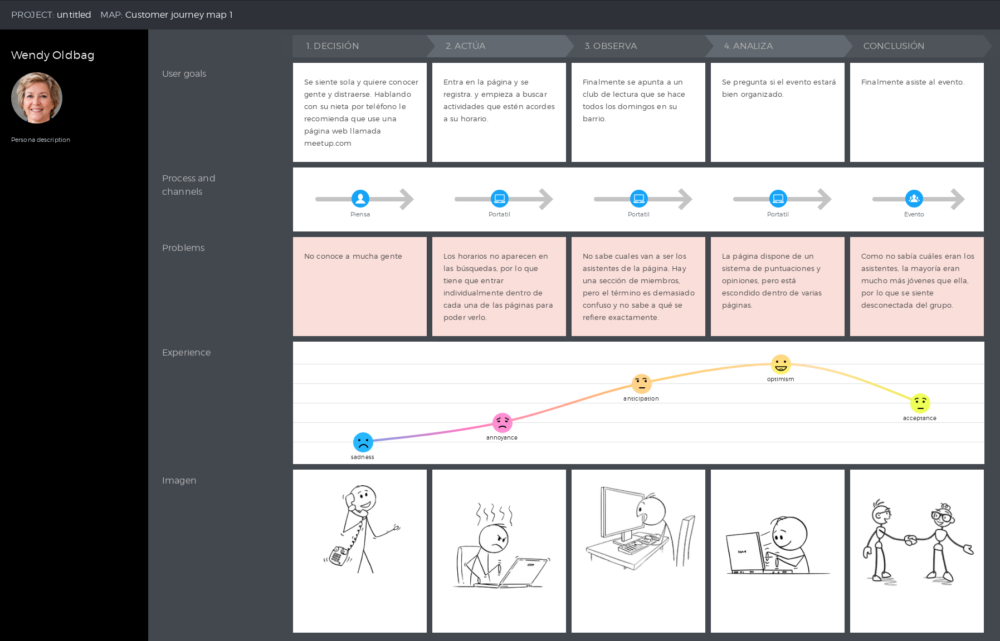

# DIU20
Prácticas Diseño Interfaces de Usuario 2019-20 (Economía Colaborativa)

Grupo: DIU3.JoinsTheBattle  Curso: 2019/20

Proyecto: Experiencias de compartir ocio.

Descripción:

Logotipo:

Miembros
 * :bust_in_silhouette: Alessandro Rinaldi Gómez  :octocat: \@Ralesdi  
 * :bust_in_silhouette: Germán Castilla López     :octocat: \@Gertis99

-----

# Do it!
## Una App de Actividades

Los seres humanos somos, por definición, seres sociales. No concebimos la vida sin la interacción con otras personas. Nos reunimos para hacer todo tipo de actividades. Pero en ocasiones nos encontramos trabas para satisfacer estas necesidades
sociales. A veces incluso, para personas introvertidas o que tengan un círculo de conocidos muy limitado puedes suponer un muro infranqueable. Nosotros decimos: ¡ya no más!

## Introducción

Buscamos crear una aplicación web que permita a cualquier persona completar dos objetivos fundamentales:
- Poder acceder a actividades de cualquier tipo cerca del usuario.
- Poder organizar actividades en las que participe gente con la posibilidad de obtener una ganancia económica.

## Oportunidades

El desarrollo de este proyecto posee oportunidades valiosas que podemos tomar para mejorar la experiencia del usuario:
- Permitir a través de la aplicación que el usuario pueda estrechar lazos de amistad con las personas con las que realiza actividades.
- Promocionar las actividades de ocio, de cualquier tipo, pero centrándonos sobre todo en las que se realizan al aire libre.
- Dinamizar las relaciones sociales en lugares donde sea dificil encontrar personas para realizar actividades.

## User Research
Hicimos una pequeña encuesta entre personas que realizan actividades de forma asidua y personas que son más reacias a esto. Preguntándoles sobre sus objetivos y necesidades al respecto.
- Los usuarios, por lo general, estan interesados en socializar.
- Los usuarios normalmente tienen rutinas marcadas y horarios específicos en los que pueden realizar actividades.
- Los usuarios no quieren tener que desplazarse demasiado para realizar estas actividades.
- Algunos usuarios buscan gente para desarrollar sus propias actividades.

# Competitive Analysis
Hemos observado que, como tónica general, las páginas de actividades de ocio suelen centrarse en actividades muy concretas, como deportes, conciertos, etc. Apenas ninguna de las páginas ofrecía una forma de obtener ganancias a través de la oferta de actividades. En muchos casos no podía saberse qué personas se habían apuntado a las actividades en cuestión. En todos los casos la forma de comunicación entre los participantes y organizadores en la página era torpe, siendo que normalmente los usuarios recurrían a las redes sociales como complemento.

# User Personas

Para ver como se sienten los usuarios respecto a las funcionalidades de las aplicaciones (en concreto de meetup.com) creamos dos personas.

Elegimos a Diego Armando y a Wendy Oldbag para tener a dos personas de edades dispares, una persona de 27 años y otra de 60. También a personas tanto con cualificaciones universitarias como de FP. Buscamos tener a personas con distintos conocimientos de informática y software. En definitiva, tener a dos personas que sean distintas y complementarias entre sí.

# Journey Map

Hemos elegido estas experiencias porque son sucesos que nos han ocurrido a nosotros mismos en varias ocasiones mientras estábamos testeando meetup.com. Pensamos que son experiencias que pueden llegar a ser reales y por eso están hechas así.

# Usability Review
Para valorar de la mejor manera posible la página (competidora) de meetup, hicimos un estudio donde valoramos de forma objetiva distintos aspectos referentes a la experiencia del usuario y otras funcionalidades, asignándole una nota final a la página web.
[documento](https://github.com/ralesdi/DIU20/blob/master/P1/UsabilityReview.pdf)
Valoración final (numérica): 78
Calificamos a esta página con esta nota debido a que nos parece que está muy bien trabajada. Es muy profesional, creemos que puede ser utilizada por todo tipo de personas debido a su accesibilidad y que en general cumple con su objetivo sin ningún problema. Si bien, para realizar funciones más allá de apuntarse a actividades está más limitada.

## UX Design  

Queremos crear una aplicación que permita más facilmente a los usuarios comunicarse entre sí para llevar a cabo actividades, añadiendo la posibilidad de que puedan tener retribuciones económicas y que puedan profesionalizar estos servicios. Queremos que sea lo más simple posible para los usuarios, intentando apelar al lenguaje simbólico en lugar del natural.

#Tasks and Sitemap

Hemos elegido la matriz ya que nos parece que es la forma más rápida y visual de ver que actividades son más importantes y se van usar más y que tipo de usuarios tendremos. Aparte de los usuarios de baja/media/alta frecuencia de nuestra web, hemos querido tener en consideración también a los usuarios que no están registrados y a los usuarios que solo están interesados en crear actividades, ya que creemos que son un grupo de personas bastante importante también.

Con esta estructura intentamos que la página sea lo más cómodamente navegable posible. Desde la página principal se puede acceder a prácticamente todas las prestaciones de la web. Dentro de la búsqueda, se podrá acceder a las actividades o grupos deseadas. Si quieres apuntarte a una actividad o grupo sin haber iniciado sesión, se te redigirá a la página de inicio de sesión, para que el usuario no tenga que dar ningún rodeo él. Desde una actividad podrás acceder al grupo que la ha creado, y desde un grupo podrás acceder a todas las actividades que dicho grupo ha creado.

## Labelling
Para empezar, creamos la jerarquía de nuestra página web. Al crearla intentamos que fuera lo más sencilla y simple posible para que el usuario se adaptara facilmente a ella. Queríamos que fuera imposible perderse, que el usuario siempre supiera donde esta.

## Design Studio
Para poder crear una aplicación, antes debemos planear como queremos que se vea, es por eso que nos dedicamos a crear bocetos que nos permitieran ver como sería el resultado final. Ponemos como muestra la página principal:

>>> [Aquí](P2/DIU_Doc.pdf) está nuestra propuesta completa de frontend.

## Wireframes
Una vez hechos los bocetos y están pulidos, podemos pasar a ver como se verían en una buena calidad.

## Style Guide
Cualquier aplicación que se precie debe tener su propio estilo, desmarcarse del resto para ser una marca única y reconocible. Por eso preparamos una Guía que nos explica el por qué de nuestras decisiones tomadas, en qué están basadas y como debe aplicarse.
La guía se encuentra [Aquí](P3/DIU_Guidelines.pdf)
